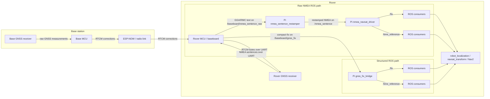
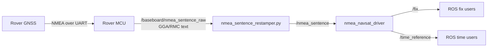
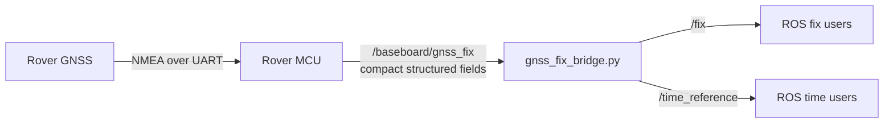

# GNSS And RTCM Message Flow

This note shows how GNSS data and RTCM corrections move through the rover system.

The important split is:

- `RTCM in`: correction data sent to the rover GNSS receiver
- `GNSS fix out`: position/time data sent from the rover GNSS receiver into ROS

## Big Picture

## What Each Part Does

### 1. Base station side

- The base GNSS receiver produces data that the base MCU uses to generate RTCM corrections.
- The base MCU sends those RTCM corrections to the rover over the radio link.

This path is about **improving the rover's GNSS solution**. It is not the same as the ROS navigation path.

### 2. Rover correction input path

- The rover MCU receives RTCM corrections over radio.
- The rover MCU forwards the RTCM bytes to the rover GNSS receiver over `Serial2`.
- The rover GNSS receiver uses those corrections internally to compute a better fix.

This is the **RTCM in** path.

### 3. Rover GNSS output path

- The rover GNSS receiver emits NMEA sentences such as `GGA` and `RMC`.
- The rover MCU reads those sentences and decides what to forward toward ROS.

This is the **GNSS fix out** path.

## Two Output Styles

### Option A: Raw NMEA path

This is the debug and diagnostics path.

Characteristics:

- preserves raw sentence text
- easy to debug with standard NMEA tools
- higher bandwidth and framing overhead on the MCU to Pi transport
- parses the GNSS data twice: once implicitly in sentence selection, once on the Pi

### Option B: Structured fix path

This is the preferred default path going forward.

Characteristics:

- sends only the fields ROS needs
- lower transport cost than raw NMEA
- easier to rate-limit cleanly
- better fit for dead reckoning plus periodic GNSS correction
- less convenient for low-level NMEA debugging

## Why RTCM Does Not Need To Change This Much

RTCM is correction data flowing **into** the rover GNSS receiver.

The GNSS output path is separate:

- RTCM in improves the solution quality
- GNSS fix out tells ROS what the current solution is

So adding RTK mostly changes the **quality of the fix**, not the basic shape of the ROS topics.

What may need to expand later is the structured message content, for example:

- RTK fixed vs RTK float
- correction age
- horizontal / vertical accuracy
- receiver-specific quality indicators

## Current Structured Message Content

The current `GnssFix` message carries:

- UTC date and time
- latitude
- longitude
- altitude
- HDOP
- satellite count
- fix quality

That is enough for a first compact ROS path, but not yet a full RTK status model.

## Publish Rate Guidance

For navigation with wheel dead reckoning:

- wheel/IMU odometry should run at a higher rate
- GNSS can usually be slower
- `5 Hz` is a reasonable first target for GNSS fix publication

That is why the structured path is currently set up to be comfortable with a slower publish period than raw NMEA.

## Practical Interpretation

If you want the simplest mental model:

1. The base station sends RTCM corrections to the rover.
2. The rover GNSS uses those corrections to improve its fix.
3. The rover MCU forwards the resulting fix to the Pi.
4. ROS consumes `/fix` and `/time_reference`.

The main design choice is only **how step 3 is encoded**:

- raw NMEA text
- or a compact structured fix message
